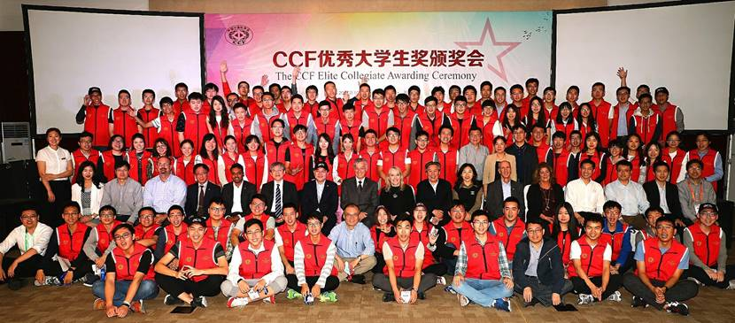

## Hi there!

I'm currently a senior undergraduate student of [Faculty of Electronic Information and Electrical Engineering](http://ee.dlut.edu.cn/), [Dalian University of Technology](http://www.dlut.edu.cn/), working in Prof. [Yang xin](http://faculty.dlut.edu.cn/yangxin)'s group as a research assistant. I am about to begin my Ph.D at [Department of Computer Science and Engineering](http://www.cse.cuhk.edu.hk), [Chinese University of Hongkong](http://cuhk.edu.hk), supervised by Prof. [WONG, Tien-Tsin](http://www.cse.cuhk.edu.hk/~ttwong/myself.html) in 2018.

My research interest includes Computer Vision, Computer Graphics and Deep Learning.

If you'd like to chat, feel free to send me an email at [huwenbodut@gmail.com](huwenbodut@gmail.com) or [huwenbo@mail.dlut.edu.cn](huwenbo@mail.dlut.edu.cn).

## News
* **November. 2017** [DnCNN-tensorflow](https://github.com/crisb-DUT/DnCNN-tensorflow): An implementation of the TIP2017 paper [Beyond a Gaussian Denoiser: Residual Learning of Deep CNN for Image Denoising (DnCNN)](http://www4.comp.polyu.edu.hk/~cslzhang/paper/DnCNN.pdf) in tensorflow.

* **October. 2017** I was recomended to achieve The CCF Elite Collegiate Award，ECA. [http://www.ccf.org.cn/c/2017-11-01/617905.shtml]

